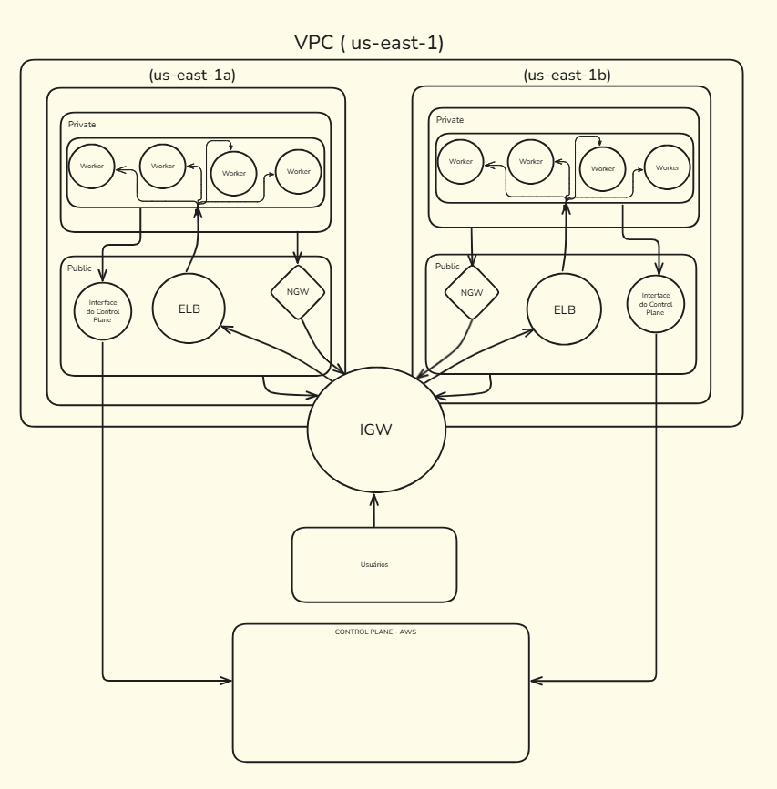

# Projeto Terraform - EKS na AWS

Infraestrutura modular para provisionamento de cluster EKS com VPC, subnets públicas e privadas, IAM roles, node groups e ALB controller.

---

# Arquitetura da Infraestrutura



O diagrama acima representa a arquitetura provisionada com Terraform para um cluster EKS na AWS. A infraestrutura está dividida em duas zonas de disponibilidade (AZs), com os seguintes componentes principais:

- **Subnets Privadas**: abrigam os *worker nodes* (Managed Node Groups) do EKS, garantindo isolamento da internet. O tráfego de saída passa por um **NAT Gateway** localizado nas subnets públicas.
- **Subnets Públicas**:
  - **Elastic Load Balancer (ELB)**: criado para controle de fluxo
  - **NAT Gateway (NGW)**: permite que as subnets privadas acessem a internet
  - **Interface de Control Plane (ENI)**: interface de rede usada para comunicação com o *API Server* do EKS. Embora o control plane seja gerenciado pela AWS fora da VPC, essa interface o torna acessível pela VPC.
- **Internet Gateway (IGW)**: conecta a VPC à internet pública.
- **Usuários**: acessam o cluster via a internet, passando pelo **IGW**, alcançando a **ENI da subnet pública**, que redireciona as requisições ao **API Server** do EKS.

---

# Exemplo de uso completo

Para facilitar, disponibilizamos um exemplo pronto com os arquivos necessários para testar este módulo.

👉 **[Baixar exemplo .zip](./extras/demo.zip)**

O pacote contém:

- `main.tf`: declaração do módulo  
- `variables.tf`: definição das variáveis  
- `terraform.tfvars`: valores usados para provisionamento  

---

### Como utilizar

1. Configure suas credenciais AWS:

```bash
    aws configure
```

2. Baixe e extraia o conteúdo do `.zip`:

```bash
   unzip demo.zip
   cd demo
```

3. Inicie o Terraform e aplique as mudanças
```bash
   terraform init
   terraform apply
```

4. Basta avaliar as aplicações e permitir.
```bash
    yes
```

---

&nbsp;

# Documentação (Terraform - Docs)
<!-- BEGIN_TF_DOCS -->
## Requirements


| Name | Version |
|------|---------|
| <a name="requirement_aws"></a> [aws](#requirement\_aws) | 4.48.0 |
| <a name="requirement_helm"></a> [helm](#requirement\_helm) | 2.8.0 |
| <a name="requirement_kubernetes"></a> [kubernetes](#requirement\_kubernetes) | 2.17.0 |

## Providers

No providers.

## Modules

| Name | Source | Version |
|------|--------|---------|
| <a name="module_eks_aws_load_balancer_controller"></a> [eks\_aws\_load\_balancer\_controller](#module\_eks\_aws\_load\_balancer\_controller) | ./modules/aws-load-balancer-controller | n/a |
| <a name="module_eks_cluster"></a> [eks\_cluster](#module\_eks\_cluster) | ./modules/cluster | n/a |
| <a name="module_eks_managed_node_group"></a> [eks\_managed\_node\_group](#module\_eks\_managed\_node\_group) | ./modules/managed-node-group | n/a |
| <a name="module_eks_network"></a> [eks\_network](#module\_eks\_network) | ./modules/network | n/a |

## Resources

No resources.

## Inputs

| Name | Description | Type | Default | Required |
|------|-------------|------|---------|:--------:|
| <a name="input_bloco-cidr"></a> [bloco-cidr](#input\_bloco-cidr) | Bloco de endereçamento CIDR a ser utilizado para a criação da VPC, definindo o escopo da rede privada na AWS. | `string` | n/a | yes |
| <a name="input_region"></a> [region](#input\_region) | Região da AWS onde os recursos serão provisionados. Exemplo: us-east-1, sa-east-1, etc. | `string` | n/a | yes |
| <a name="input_tags"></a> [tags](#input\_tags) | Mapa de tags aplicadas a todos os recursos AWS criados. Utilizadas para organização, controle de custos e políticas de compliance. | `map(any)` | n/a | yes |

## Outputs

| Name | Description |
|------|-------------|
| <a name="output_ca"></a> [ca](#output\_ca) | n/a |
| <a name="output_endpoint"></a> [endpoint](#output\_endpoint) | n/a |
| <a name="output_oidc"></a> [oidc](#output\_oidc) | n/a |
<!-- END_TF_DOCS -->

